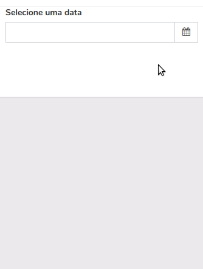
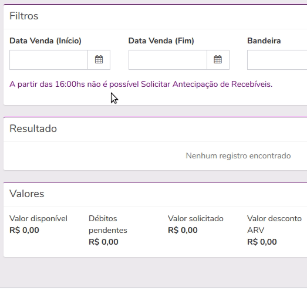
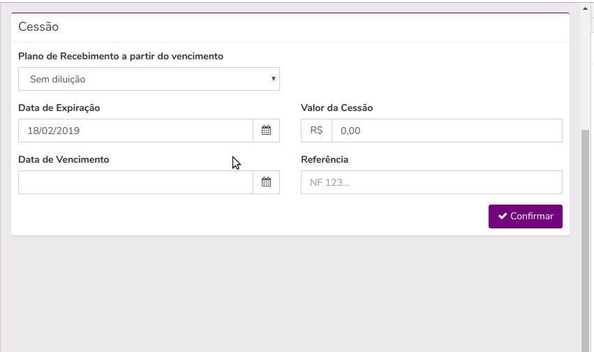

# Date-picker - Angular Material Date Picker

No módulo em que `seu.component.ts` está declarado importe o módulo `DatePickerModule` para poder usar o componente date-picker:

```TypeScript
@NgModule({
    imports: [
        DatePickerModule
    ],
    declarations: [
        SeuComponent
    ],
    exports: [
        SeuComponent
    ]
})
export class SeuModule { }
```

No `seu.component.html` agora você pode usar o componente date-picker, a forma mais básica de uso é:

```HTML
<div class="col-md-4">
    <date-picker [formControl]="seusControls.suaData"></date-picker>
</div>
```

Vai ficar assim:



No seu HTML será incluído uma `div.form-group` com label e elementos necessários do date-picker. 

O date-picker se encarrega de comunicar qualquer alteração de data entre o input (já com a máscara `dd/MM/yyyy` implementada), o angular material datepicker e o seu formControl. Assim todos sempre estarão conectados tendo o mesmo valor.

---

Apenas para deixar registrado, nada muda no `seu.component.ts`, continua da mesma forma que seria num input de tipo texto normal:

```TypeScript
export class SeuComponent {
    controls = {
        suaData: new FormControl( /*valorInicial*/ ),
    }
    form = new FormGroup(this.controls);

    action() {
        const obj = this.form.value;
        console.log(obj);
    }
```

---

## Outras propriedades do date-picker

### `@Input() label = 'Selecione uma data';`

Você pode trocar o texto padrão passando a sua propriedade `label`.

```HTML
<date-picker [formControl]="filter.inicioVigencia"
             label="Início Vigência">
</date-picker>
```

Um exemplo de label com interpolação de texto existe em `dados-societarios.coponent.html`:

```HTML
<date-picker [formControl]="group.controls.aberturaNascimento"
             [label]="'Data de ' + (group.controls.tipoPessoa.value == tiposPessoa.fisica ? 'Nascimento' : 'Abertura')">
</date-picker>
```

---

### `@Input() labelClass?: string;`

Você pode querer estilizar sua label com uma ou mais classes, como ocorre em `cessao-detalhe.component.html`:

```HTML
<date-picker [formControl]="dataExpiracao"
             label="Prazo de Aprovação:"
             labelClass="small">
</date-picker>
```

---

### `@Input() id?: string;`

Usando a propriedade id, o componente irá preencher o atributo `for` da `<label>` para você, assim como (claro) setar o identificador `id` no input. Isso permite que quando você clicar na label o input ganhe foco.

Exemplo de id dinâmico, criado dentro de um `*ngFor` em `dados-societarios.coponent.html`:

```HTML
<date-picker [formControl]="group.controls.aberturaNascimento"
             [id]="'inputAberturaNascimento_' + i">
</date-picker>
```

---

### `@Input() hasError = false;`

Frequentemente você precisará validar se a data digitada/escolhida pelo usuário atende à certas pré-condições.

Você não precisa tratar se já houve interação com o componente como você faria normalmente usando `&& (seuFormControl.dirty || seuFormControl.touched)`, o componente trata isso automaticamente para você usando a instância do seu `[formControl]`.

Você pode criar uma função customizada como em `antecipar-estabelecimento.component.ts`:

```TypeScript
hasError = {
    dataVendaInicio: () => {
        if (!this.form.value.dataVendaInicio && this.controls.dataVendaInicio.touched) {
            return 'A data de venda inicial é obrigatória';
        }
        if (this.form.value.dataVendaInicio && this.form.value.dataVendaFim) {
            if (this.form.value.dataVendaFim < this.form.value.dataVendaInicio) {
                return 'A data final deve ser maior que a data inicial.';
            }
        }
    },
    dataVendaFim: () => {
        if (this.form.value.dataVendaInicio && this.form.value.dataVendaFim) {
            if (this.form.value.dataVendaFim < this.form.value.dataVendaInicio) {
                return 'A data final deve ser maior que a data inicial.';
            }
        }
    },
};
```

E como em `antecipar-estabelecimento.component.html` passar o valor string retornado (ou outro valor verdadeiro) na propriedade `hasError`. Assim a classe `has-error` existirá quando houver algum erro na data digitada/selecionada:

```HTML
<div class="col-md-3">
    <date-picker [formControl]="controls.dataVendaInicio"
                 label="Data Venda (Início)" 
                 id="inputDataVendaInicio"
                 [hasError]="hasError.dataVendaInicio()">
    </date-picker>
</div>
<div class="col-md-3">
    <date-picker [formControl]="controls.dataVendaFim"
                 label="Data Venda (Fim)"
                 id="inputDataVendaFim"
                 [hasError]="hasError.dataVendaFim()">
    </date-picker>
</div>
```

Veja o resultado esperado no gif abaixo:



---

Você pode também usar a propriedade `invalid` do `formControl` sem problemas, como está sendo usado em `dados-societarios.coponent.html`:

```HTML
<date-picker [formControl]="group.controls.aberturaNascimento"
             [hasError]="group.controls.aberturaNascimento.invalid">
</date-picker>
```

Para usar dessa forma basta setar os validators no seu formControl como em `dados-societarios.coponent.ts`:

```TypeScript
new FormControl('', [
    Validators.required,
    DataFunctions.validatorDataFutura
]),
```

---

### `@Input() disable = false;`

Pode ser que em alguns casos você precise travar a edição/seleção de novas datas dependendo do estado da tela, como em solicitar cessão `parcelado.html` que no estado `calculado` desabilita o date-picker:

```HTML
<date-picker [formControl]="_form.dataVencimento"
             label="Data de Vencimento"
             id="dataVencimento"
             [hasError]="hasError.dataVencimento()"
             [disable]="calculado">
</date-picker>
```

- Por que `disable` e não `disabled`?
Isso é para o angular não entrar em conflito, já que no HTML existe o atributo `disabled`.

---

### `@Input() dateChanged?: (newDate: Date) => void;`

Caso você precise fazer um tratamento imediato, logo após o usuário optar por uma nova data, você pode passar uma função na propriedade `[dateChanged]`, essa será chamada adequadamente.

Segue exemplo de validação de Data de Expiração existente nas telas de solicitação de cessão (default, parcelada e recorrente):

```HTML
<date-picker [formControl]="_form.dataExpiracao"
             label="Data de Expiração"
             id="dataExpiracao"
             [hasError]="hasError.dataExpiracao()"
             [disable]="calculado"
             [dateChanged]="warnings.dataExpiracao">
</date-picker>
```

Para completar o exemplo, segue código da função no componente:

```TypeScript
warnings = {
    dataExpiracao: (newDate) => {
        this.service.warningDataExpiracaoFinalSemana(newDate);
    }
};
```

E o código presente em `cessao.service.ts`:

```TypeScript
warningDataExpiracaoFinalSemana(newDate) {
    const expirationDate = DateTime.fromJSDate(newDate);
    if (expirationDate.weekday in this.weekend) {
        this.notification.showAlertMessage('A data de expiração cairá em um final de semana');
        return;
    }
}
```

Veja em ação:



---

### =)

Caso precise de uma funcionalidade nova, altere o componente, teste bem, atualize a documentação aqui e avise no canal do slack.
